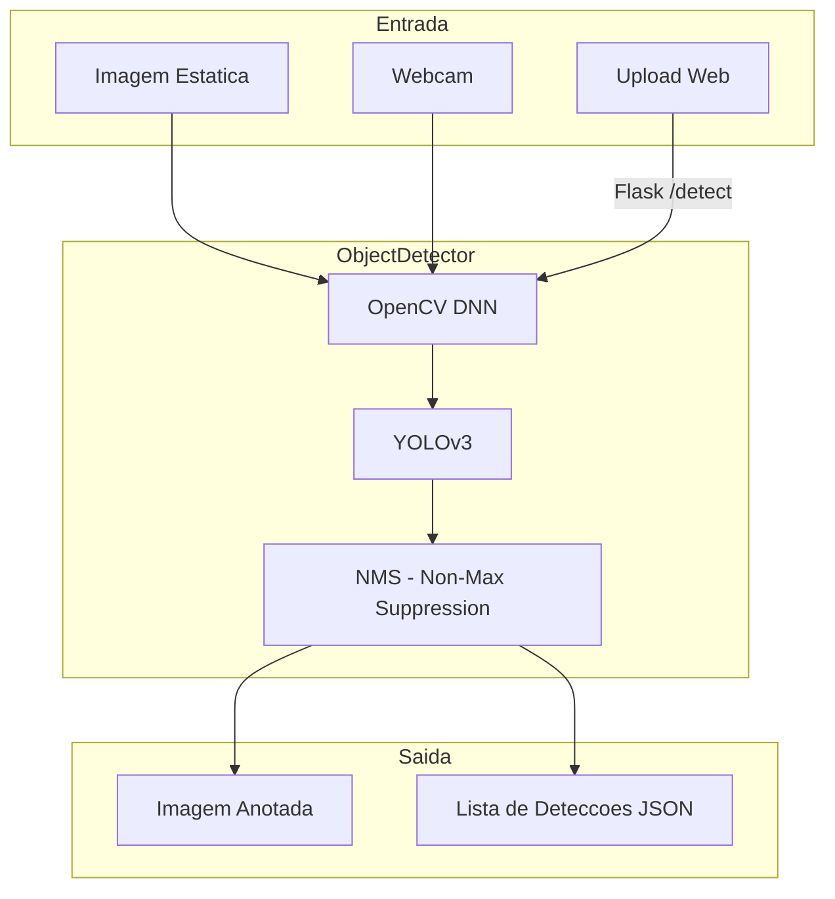
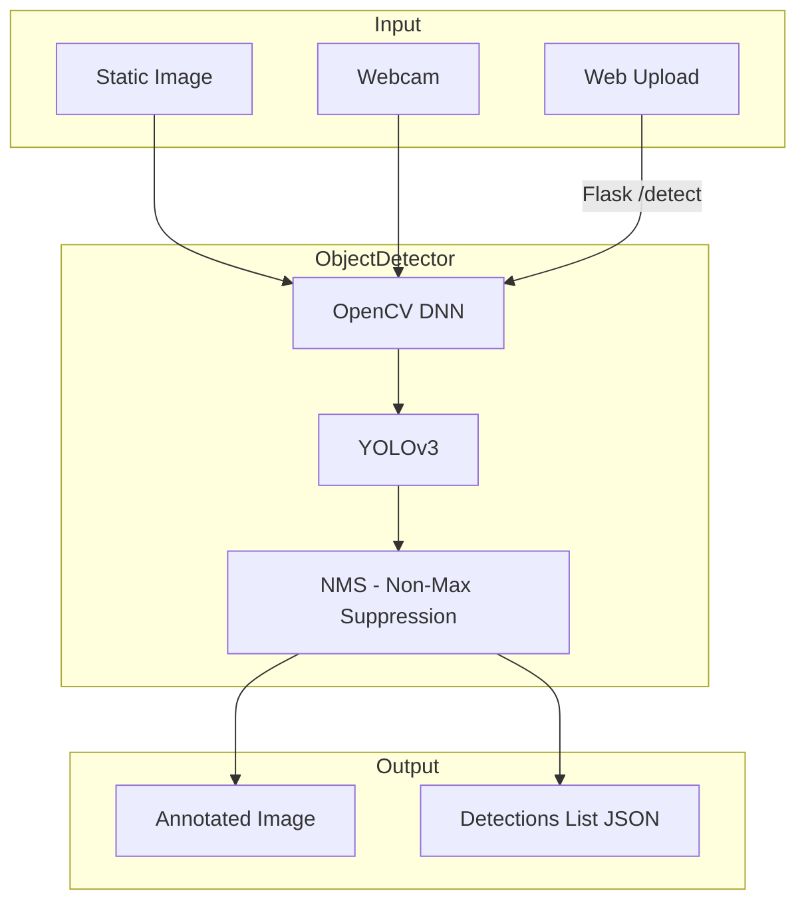

# Computer Vision Object Detection

Deteccao de objetos em imagens e video usando YOLOv3 com OpenCV DNN.

[](https://python.org)
[](https://opencv.org)
[](https://flask.palletsprojects.com)
[](LICENSE)

[English](#english) | [Portugues](#portugues)

---

## Portugues

### Visao Geral

Sistema de deteccao de objetos que utiliza o modelo YOLOv3 pre-treinado (COCO dataset — 80 classes) via OpenCV DNN. Suporta tres modos de operacao: deteccao em imagens estaticas, deteccao em tempo real via webcam, e upload de imagens via interface web Flask.

**Importante:** Os arquivos do modelo YOLOv3 (~237 MB) nao estao incluidos no repositorio e devem ser baixados separadamente.

### Arquitetura



### Pre-requisitos

#### Baixar Arquivos do Modelo YOLOv3

Crie o diretorio `config/` e baixe os 3 arquivos necessarios:

```bash
mkdir -p config

# Pesos do YOLOv3 (~237 MB)
wget https://pjreddie.com/media/files/yolov3.weights -O config/yolov3.weights

# Configuracao do YOLOv3
wget https://raw.githubusercontent.com/pjreddie/darknet/master/cfg/yolov3.cfg -O config/yolov3.cfg

# Nomes das classes COCO (80 classes)
wget https://raw.githubusercontent.com/pjreddie/darknet/master/data/coco.names -O config/coco.names
```

### Como Executar

```bash
# Instalar dependencias
pip install -r requirements.txt

# Deteccao em imagem
python src/object_detector.py --image caminho/para/imagem.jpg

# Deteccao via webcam (tempo real)
python src/object_detector.py --webcam

# Interface web (upload de imagens)
python src/object_detector.py --web
# Acesse http://localhost:5000
```

### Modos de Operacao

| Modo | Comando | Descricao |
|------|---------|-----------|
| Imagem | `--image <path>` | Detecta objetos em uma imagem e salva resultado |
| Webcam | `--webcam` | Deteccao em tempo real via webcam |
| Web | `--web` ou sem argumentos | Interface web Flask para upload |

### Estrutura do Projeto

```
Computer-Vision-Object-Detection/
├── config/                    # Arquivos do modelo (nao incluidos)
│   ├── yolov3.cfg
│   ├── yolov3.weights
│   └── coco.names
├── src/
│   ├── __init__.py
│   └── object_detector.py    # Modulo principal (~350 linhas)
├── LICENSE
├── README.md
└── requirements.txt
```

### Tecnologias

| Tecnologia | Uso |
|------------|-----|
| Python | Linguagem principal |
| OpenCV DNN | Inferencia do modelo YOLOv3 |
| NumPy | Processamento de arrays |
| Flask | Interface web para upload |
| YOLOv3 | Modelo pre-treinado (COCO, 80 classes) |

---

## English

### Overview

Object detection system using the pre-trained YOLOv3 model (COCO dataset — 80 classes) via OpenCV DNN. Supports three modes: static image detection, real-time webcam detection, and image upload via a Flask web interface.

**Important:** YOLOv3 model files (~237 MB) are not included in the repository and must be downloaded separately.

### Architecture



### Prerequisites

#### Download YOLOv3 Model Files

Create the `config/` directory and download the 3 required files:

```bash
mkdir -p config

# YOLOv3 weights (~237 MB)
wget https://pjreddie.com/media/files/yolov3.weights -O config/yolov3.weights

# YOLOv3 configuration
wget https://raw.githubusercontent.com/pjreddie/darknet/master/cfg/yolov3.cfg -O config/yolov3.cfg

# COCO class names (80 classes)
wget https://raw.githubusercontent.com/pjreddie/darknet/master/data/coco.names -O config/coco.names
```

### How to Run

```bash
# Install dependencies
pip install -r requirements.txt

# Image detection
python src/object_detector.py --image path/to/image.jpg

# Webcam detection (real-time)
python src/object_detector.py --webcam

# Web interface (image upload)
python src/object_detector.py --web
# Open http://localhost:5000
```

### Operation Modes

| Mode | Command | Description |
|------|---------|-------------|
| Image | `--image <path>` | Detect objects in an image and save result |
| Webcam | `--webcam` | Real-time detection via webcam |
| Web | `--web` or no args | Flask web interface for upload |

### Project Structure

```
Computer-Vision-Object-Detection/
├── config/                    # Model files (not included)
│   ├── yolov3.cfg
│   ├── yolov3.weights
│   └── coco.names
├── src/
│   ├── __init__.py
│   └── object_detector.py    # Main module (~350 lines)
├── LICENSE
├── README.md
└── requirements.txt
```

### Technologies

| Technology | Usage |
|------------|-------|
| Python | Core language |
| OpenCV DNN | YOLOv3 model inference |
| NumPy | Array processing |
| Flask | Web interface for upload |
| YOLOv3 | Pre-trained model (COCO, 80 classes) |

---

**Autor / Author:** Gabriel Demetrios Lafis
- GitHub: [@galafis](https://github.com/galafis)
- LinkedIn: [Gabriel Demetrios Lafis](https://linkedin.com/in/gabriel-demetrios-lafis)
