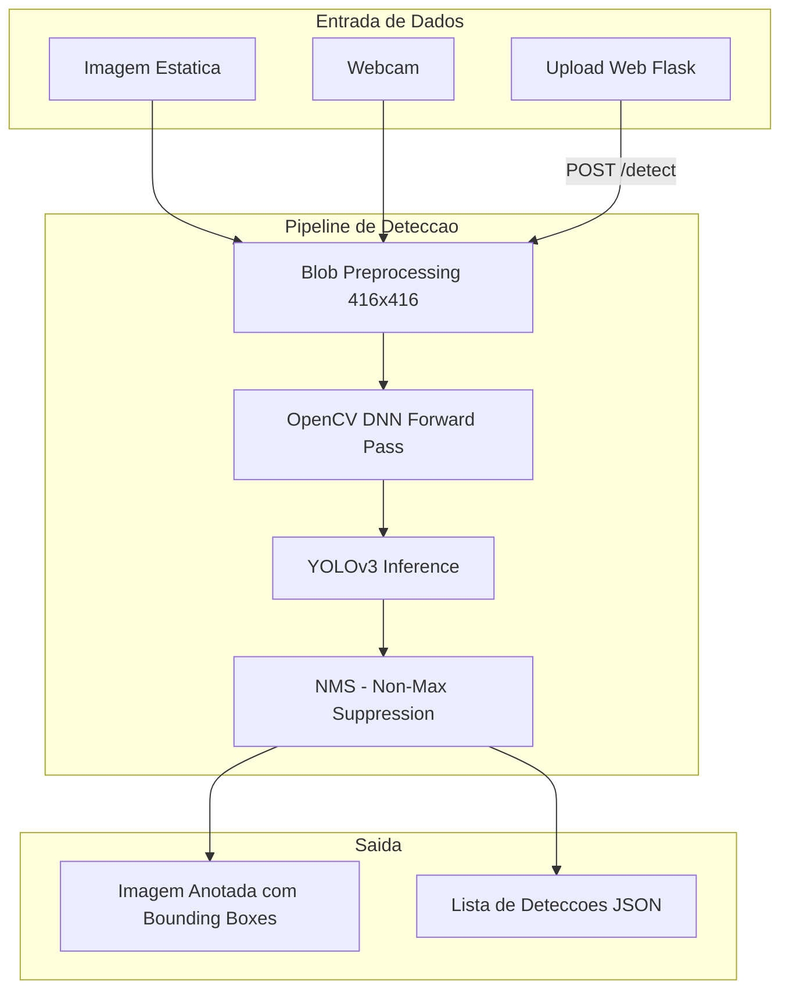
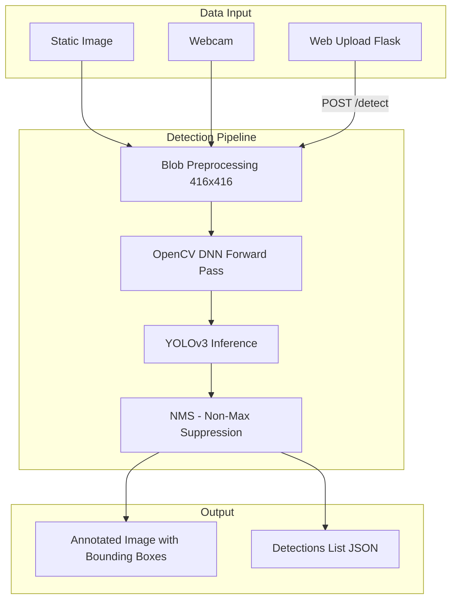

<div align="center">

# Computer Vision Object Detection

[](https://python.org)
[](https://opencv.org)
[](https://flask.palletsprojects.com)
[](Dockerfile)
[](LICENSE)

Sistema de deteccao de objetos em imagens e video utilizando YOLOv3 com OpenCV DNN.

Object detection system for images and video using YOLOv3 with OpenCV DNN.

[Portugues](#portugues) | [English](#english)

</div>

---

## Portugues

### Sobre

Este projeto implementa um sistema completo de deteccao de objetos utilizando o modelo YOLOv3 pre-treinado no dataset COCO (80 classes). O sistema oferece tres modos de operacao: deteccao em imagens estaticas, deteccao em tempo real via webcam e uma interface web construida com Flask para upload de imagens. O foco didatico esta na compreensao do pipeline de visao computacional, desde o pre-processamento da imagem ate a aplicacao de Non-Maximum Suppression (NMS) para filtrar deteccoes redundantes.

### Tecnologias

| Tecnologia | Versao | Finalidade |
|------------|--------|------------|
| Python | 3.11+ | Linguagem principal |
| OpenCV DNN | 4.5+ | Inferencia do modelo YOLOv3 |
| NumPy | 1.21+ | Manipulacao de arrays e tensores |
| Flask | 3.0+ | Interface web para upload de imagens |
| YOLOv3 | COCO | Modelo pre-treinado com 80 classes |
| Docker | - | Containerizacao da aplicacao |

### Arquitetura


```mermaid
graph TD
    subgraph Entrada["Entrada de Dados"]
        A[Imagem Estatica]
        B[Webcam]
        C[Upload Web Flask]
    end

    subgraph Pipeline["Pipeline de Deteccao"]
        D[Blob Preprocessing 416x416]
        E[OpenCV DNN Forward Pass]
        F[YOLOv3 Inference]
        G[NMS - Non-Max Suppression]
    end

    subgraph Saida["Saida"]
        H[Imagem Anotada com Bounding Boxes]
        I[Lista de Deteccoes JSON]
    end

    A --> D
    B --> D
    C -->|POST /detect| D
    D --> E --> F --> G
    G --> H
    G --> I
```

### Estrutura do Projeto

```
Computer-Vision-Object-Detection/
├── config/                        # Arquivos do modelo (download manual)
│   ├── yolov3.cfg                 # Configuracao da rede YOLOv3
│   ├── yolov3.weights             # Pesos pre-treinados (~237 MB)
│   └── coco.names                 # Nomes das 80 classes COCO
├── src/
│   ├── __init__.py
│   └── object_detector.py         # Modulo principal com classe ObjectDetector
├── .gitignore
├── Dockerfile
├── LICENSE
├── README.md
└── requirements.txt
```

### Quick Start

#### 1. Baixar Arquivos do Modelo

```bash
mkdir -p config

# Pesos do YOLOv3 (~237 MB)
wget https://pjreddie.com/media/files/yolov3.weights -O config/yolov3.weights

# Configuracao do YOLOv3
wget https://raw.githubusercontent.com/pjreddie/darknet/master/cfg/yolov3.cfg -O config/yolov3.cfg

# Nomes das classes COCO
wget https://raw.githubusercontent.com/pjreddie/darknet/master/data/coco.names -O config/coco.names
```

#### 2. Instalar e Executar

```bash
pip install -r requirements.txt

# Deteccao em imagem estatica
python src/object_detector.py --image caminho/para/imagem.jpg

# Deteccao em tempo real via webcam
python src/object_detector.py --webcam

# Interface web (http://localhost:5000)
python src/object_detector.py --web
```

### Docker

```bash
docker build -t cv-object-detection .
docker run -p 5000:5000 cv-object-detection
```

> **Nota:** Os arquivos do modelo YOLOv3 devem estar no diretorio `config/` antes do build.

### Modos de Operacao

| Modo | Comando | Descricao |
|------|---------|-----------|
| Imagem | `--image <caminho>` | Detecta objetos e salva imagem anotada |
| Webcam | `--webcam` | Deteccao em tempo real com exibicao de FPS |
| Web | `--web` | Interface Flask para upload via navegador |

### Testes

```bash
# Testar deteccao em imagem
python src/object_detector.py --image test_image.jpg

# Verificar se o modelo carrega corretamente
python -c "from src.object_detector import ObjectDetector; print('OK')"
```

### Aprendizados

- Pipeline completo de visao computacional com YOLOv3 e OpenCV DNN
- Aplicacao de Non-Maximum Suppression para eliminacao de deteccoes duplicadas
- Utilizacao de CUDA para aceleracao por GPU quando disponivel
- Construcao de interface web com Flask para servir modelos de deep learning
- Containerizacao de aplicacoes de visao computacional com Docker

---

## English

### About

This project implements a complete object detection system using the pre-trained YOLOv3 model on the COCO dataset (80 classes). The system provides three operation modes: static image detection, real-time webcam detection, and a Flask-based web interface for image uploads. The educational focus is on understanding the computer vision pipeline, from image preprocessing to applying Non-Maximum Suppression (NMS) for filtering redundant detections.

### Technologies

| Technology | Version | Purpose |
|------------|---------|---------|
| Python | 3.11+ | Core language |
| OpenCV DNN | 4.5+ | YOLOv3 model inference |
| NumPy | 1.21+ | Array and tensor manipulation |
| Flask | 3.0+ | Web interface for image upload |
| YOLOv3 | COCO | Pre-trained model with 80 classes |
| Docker | - | Application containerization |

### Architecture


```mermaid
graph TD
    subgraph Input["Data Input"]
        A[Static Image]
        B[Webcam]
        C[Web Upload Flask]
    end

    subgraph Pipeline["Detection Pipeline"]
        D[Blob Preprocessing 416x416]
        E[OpenCV DNN Forward Pass]
        F[YOLOv3 Inference]
        G[NMS - Non-Max Suppression]
    end

    subgraph Output["Output"]
        H[Annotated Image with Bounding Boxes]
        I[Detections List JSON]
    end

    A --> D
    B --> D
    C -->|POST /detect| D
    D --> E --> F --> G
    G --> H
    G --> I
```

### Project Structure

```
Computer-Vision-Object-Detection/
├── config/                        # Model files (manual download)
│   ├── yolov3.cfg                 # YOLOv3 network configuration
│   ├── yolov3.weights             # Pre-trained weights (~237 MB)
│   └── coco.names                 # 80 COCO class names
├── src/
│   ├── __init__.py
│   └── object_detector.py         # Main module with ObjectDetector class
├── .gitignore
├── Dockerfile
├── LICENSE
├── README.md
└── requirements.txt
```

### Quick Start

#### 1. Download Model Files

```bash
mkdir -p config

# YOLOv3 weights (~237 MB)
wget https://pjreddie.com/media/files/yolov3.weights -O config/yolov3.weights

# YOLOv3 configuration
wget https://raw.githubusercontent.com/pjreddie/darknet/master/cfg/yolov3.cfg -O config/yolov3.cfg

# COCO class names
wget https://raw.githubusercontent.com/pjreddie/darknet/master/data/coco.names -O config/coco.names
```

#### 2. Install and Run

```bash
pip install -r requirements.txt

# Static image detection
python src/object_detector.py --image path/to/image.jpg

# Real-time webcam detection
python src/object_detector.py --webcam

# Web interface (http://localhost:5000)
python src/object_detector.py --web
```

### Docker

```bash
docker build -t cv-object-detection .
docker run -p 5000:5000 cv-object-detection
```

> **Note:** YOLOv3 model files must be in the `config/` directory before building.

### Operation Modes

| Mode | Command | Description |
|------|---------|-------------|
| Image | `--image <path>` | Detect objects and save annotated image |
| Webcam | `--webcam` | Real-time detection with FPS display |
| Web | `--web` | Flask interface for browser upload |

### Tests

```bash
# Test image detection
python src/object_detector.py --image test_image.jpg

# Verify model loads correctly
python -c "from src.object_detector import ObjectDetector; print('OK')"
```

### Learnings

- End-to-end computer vision pipeline with YOLOv3 and OpenCV DNN
- Non-Maximum Suppression for eliminating duplicate detections
- CUDA acceleration for GPU-enabled inference when available
- Building web interfaces with Flask for serving deep learning models
- Containerizing computer vision applications with Docker

---

### Autor / Author

**Gabriel Demetrios Lafis**

[](https://github.com/galafis)
[](https://linkedin.com/in/gabriel-demetrios-lafis)

### Licenca / License

Este projeto esta licenciado sob a [MIT License](LICENSE).
